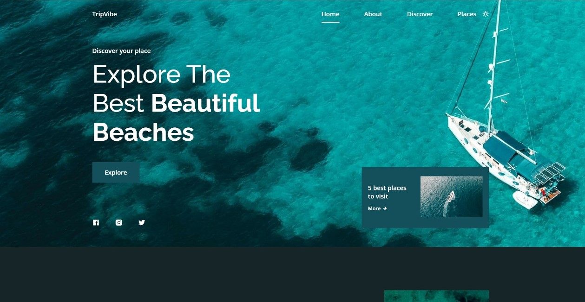
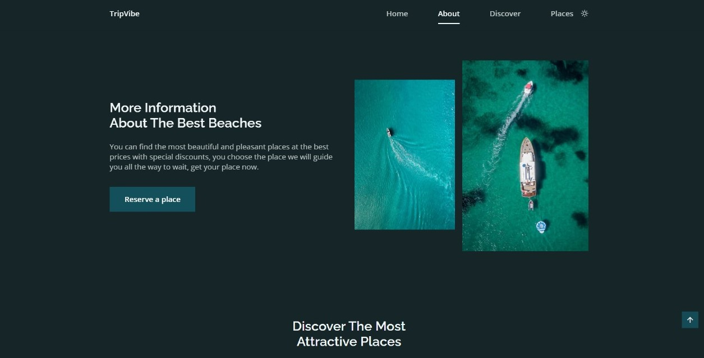
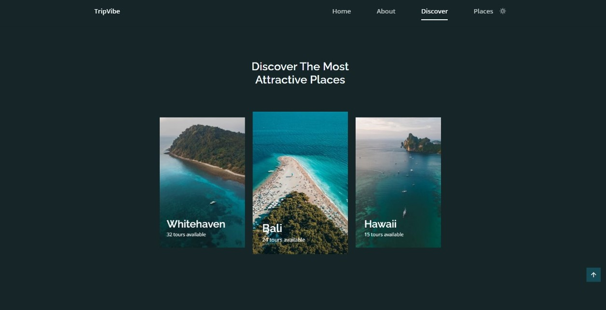
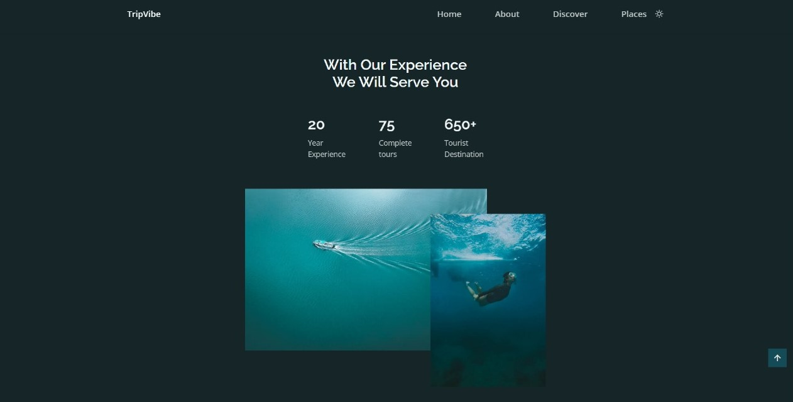
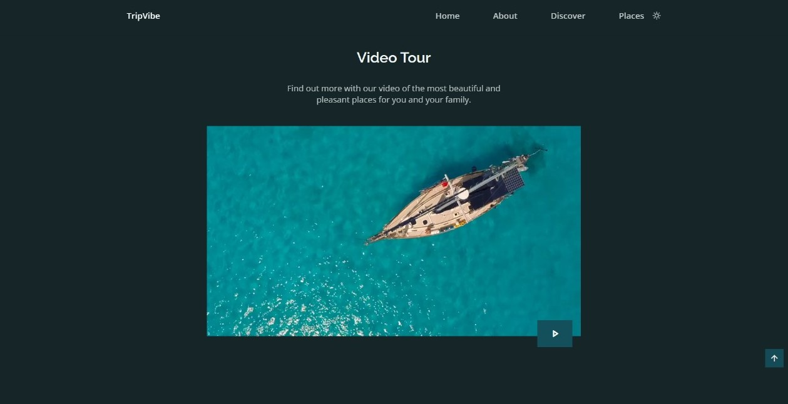
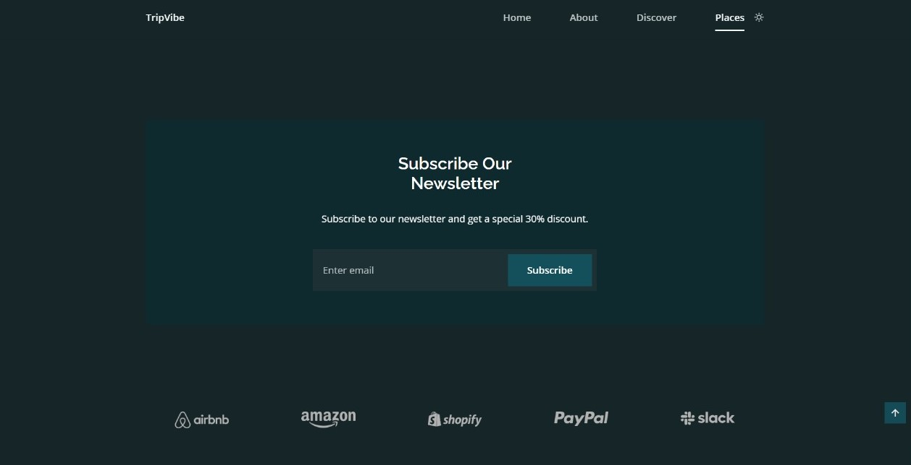
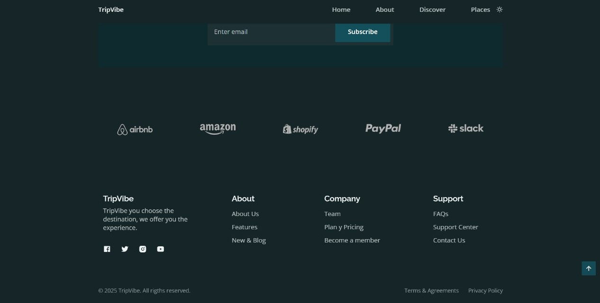

# 🌴 TripVibe – Travel Website

> 🧳 Plan → Explore → Book → Travel  
> A mobile-first, modern travel website for exploring beautiful destinations and planning your perfect trip with ease.

---

## 🚀 What is this?

TripVibe is a sleek and responsive travel website designed to offer a seamless user experience for trip planning. Users can browse trending destinations, check deals, and explore adventure activities, all from a mobile-first interface that adapts perfectly to all screen sizes.

---

## ✨ Why This Matters

- 📱 Mobile-first and responsive design  
- ✈️ Makes trip planning simple and interactive  
- 🌍 Showcases popular and exotic travel destinations  
- 🧭 Encourages travel enthusiasm among users  
- 💻 Beginner-friendly frontend for practice and demos

---

## 🔥 Features at a Glance

✅ Clean and attractive UI  
✅ Trending destinations and activity sections  
✅ Explore trips and holiday deals  
✅ Fully responsive layout  
✅ Easy navigation and smooth animations  

---

## 🧰 Tech Stack

| Layer        | Tools Used         |
|--------------|--------------------|
| **Frontend** | HTML, CSS, JavaScript |
| **Design**   | Mobile-first layout |
| **Deployment** | Netlify |

---

## 📦 Ideal Use Cases

🧑‍💻 **Frontend practice and project showcase**  
🧭 **Travel startup landing page**  
📱 **Demo for responsive design**  
🌐 **Inspiration for tourism businesses**  

---

## 🛡️ Highlights

- ✅ Built with accessibility and responsiveness in mind  
- ✅ Clear layout with intuitive UX design  
- ✅ Optimized for fast loading and smooth scrolling  

---

## 🌍 Screenshots

---

## 👨‍💻 Meet the Creator

👤 **Name** | 🔗 **Connect**  
---|---  
**Preetam Kumawat** | [Email](mailto:preetamkumawat002@gmail.com) • [LinkedIn](https://www.linkedin.com/in/kumawatpreetam/)
**Sudhanshu Bagoriya** | [Email](mailto:sudhanshubagoriya@gmail.com) • [LinkedIn](https://www.linkedin.com/in/sudhanshu-bagoriya-240799282/)
**Himanshu Kumawat** | [Email](mailto:himanshuk2706@gmail.com) • [LinkedIn](https://www.linkedin.com/in/himanshu-kumawat-866473296)
**Gulshan Jangir** | [Email](mailto:gulshansharma7x@gmail.com) • [LinkedIn](https://www.linkedin.com/in/gulshan-jangir-a4b64328b/)

---
